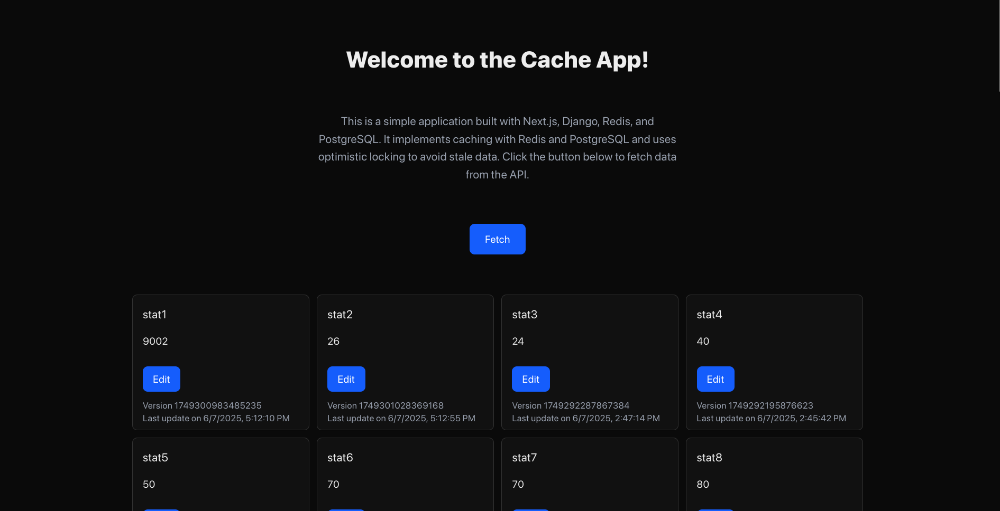

# Cache App

This is an web application built with Next.js, Django, Redis, and PostgreSQL. It implements 
cache handling in the backend with the following features:

* The LRU algorithm as a cache eviction policy
* Usage of optimistic locking while updating an instance to avoid stale data
* Redis locking to prevent cache stampede
* Sends cached data if the cache is found, otherwise fetches it from the database

and has a frontend built with Next.js that displays the data.

## Demo



See [demo video](https://github.com/nebulaw/cache-app/raw/refs/heads/main/media/demo.mp4).

## Getting Started

This project is divided into two parts - `backend` and `frontend`. The `backend` is a Django application that handles the database operations and implements the cache handling logic. The `frontend` is a Next.js application that fetches data from the `backend` and displays it for demonstration purposes.

### Environment Variables

The backend and frontend apps use environment variables to work properly. I have
provided a template file [.env.template](./.env.template) that you can use to create
a `.env` file. You can even rename it to `.env` for simplicity and it will work.

There is another file [frontend/.env](./frontend/.env.template) and you can rename
it to `.env` as well. It stores the API endpoint from the backend to fetch data.

## Docker

There is an option to run the application using just Docker. So you'd like to have Docker and Docker Compose installed.

### Build

After setting up `.env` and `frontend/.env`, you can build the containers by running the following command:

```bash
docker compose build --no-cache
```

### Run

After the build, you can run the containers by running the following command:

```bash
docker compose up -d
```

Now you are ready to visit the website at http://localhost:3000.

### Important Note

When you run the containers for the first time, the database will be created but the sample data will not be loaded. You can load the sample data by running the following command. You can replace the number of sample data with the desired number. It will be persisted in the database and can be used for the next time you run the application too.

```bash
docker exec -it cache_app_django python manage.py load_sample_stats --n-sample=16
```

### Stop

If you want to stop the containers, you can run the following command:

```bash
docker compose down
```
